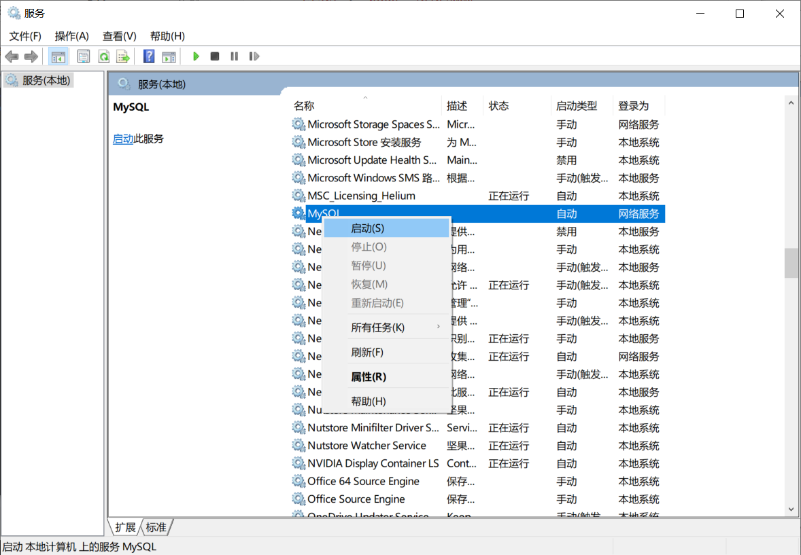
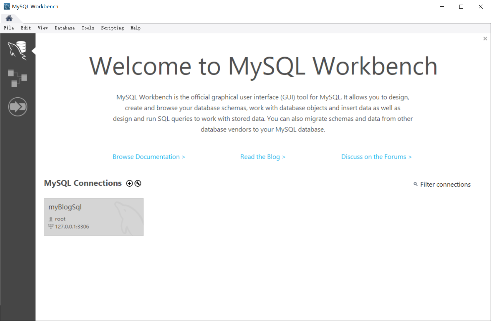
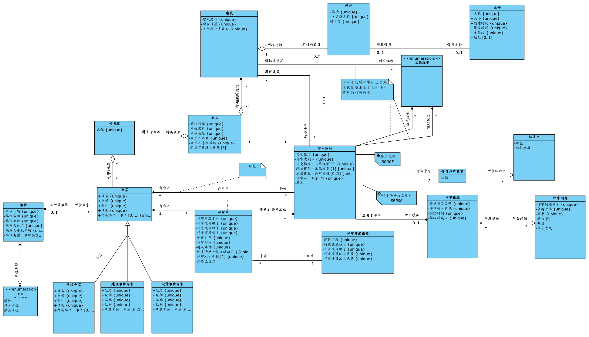

# 建筑评审项目后端开发

## 1 Express 框架安装

### 1.1 基本安装

全局安装 Express

`npm install express-generator -g`

然后在想要安装的上一级目录输入

`express server` 

安装依赖

`npm install`

开始访问

`npm start`

初始默认的 server 为 http://localhost:3000

### 1.2 修改配置

修改 bin/www.js 文件，在 script 中添加命令

```javascript
"scripts": {
  "start": "node ./bin/www",
  "dev": "cross-env NODE_ENV=dev nodemon ./bin/www"
 },
```

安装 nodemon(安装了则不需要安装) 与 cross-env ，输入

`npm i nodemon cross-env --save-dev`

启动 server 端为输入

`npm run dev`

在 bin/www.js 中修改端口号，第15行，修改为

`var port = normalizePort(process.env.PORT || '8888');`

启动 url 为 http://localhost:8888

### 1.3 安装依赖

安装 mysql 依赖

`npm i mysql --save`

安装 Mysql 和 MysqlWorkBench

[MySQL及MySQL-workbench安装 - 知乎 (zhihu.com)](https://zhuanlan.zhihu.com/p/26657483)

在 服务 中 启动Mysql



打开 MysqlWorkBench 操作 Mysql 数据库



安装 redis 依赖

`npm i redis --save`

安装 jsonwebtoken

`npm install jsonwebtoken`

## 2 数据库操作细则



## 3 编程难点

### 3.1 登录验证

- 使用token

```javascript
const jwt = require('jsonwebtoken'); 
```

- 卡在登录失败的返回数据，关键在于 controller/users.js 的处理

```javascript
return exec(sql).then(rows => {
        if (rows[0]!=null){
            let content = {
                id: rows[0].id || '',
                name: rows[0].name || '',
                address: rows[0].address || '',
                contactName: rows[0].contactName || '',
                contactTelNumber: rows[0].contactTelNumber || '',
                username: rows[0].username || ''
            };
            let secretOrPrivateKey = "jwt";// 这是加密的key（密钥）
            let token = jwt.sign(content, secretOrPrivateKey, {
                expiresIn: 60 * 60 * 1  // 1小时过期
            });
            rows[0].token = token
        }
        // console.log(typeof(rows[0]))
        // console.log(rows[0])
        // console.log(token)
        return rows[0] || {}
    })
```

- 解决跨域

```javascript
npm install cors --save-dev

const cors = require('cors');
app.use(cors());
```

- 挂载路由守卫

```javascript
// 挂载路由导航守卫
router.beforeEach((to, from, next) => {
  // to 将要访问的路径
  // from 代表从哪个路径跳转而来
  // next 是一个函数，表示放行
  //     next()  放行    next('/login')  强制跳转

  if (to.path === '/login') return next()
  // 获取token
  const tokenStr = window.sessionStorage.getItem('token')
  if (!tokenStr) return next('/login')
  next()
})
```

## 4 尚未解决的问题

## 5 掉下的坑

### 5.1 req.query 与 req.body

- 使用 `req.query` 将会使用 Params 传递参数
- 使用 `req.body` 将会使用 body 传参

与 `res.json()` 并无关系
